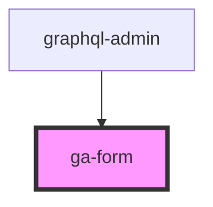

# ga-form

<!-- Auto Generated Below -->

## Properties

| Property | Attribute | Description | Type      | Default     |
| -------- | --------- | ----------- | --------- | ----------- |
| `model`  | --        |             | `GAModel` | `undefined` |
| `side`   | --        |             | `String`  | `undefined` |

## Events

| Event                | Description | Type               |
| -------------------- | ----------- | ------------------ |
| `formSubmittedEvent` |             | `CustomEvent<any>` |
| `modelUpdated`       |             | `CustomEvent<any>` |
| `subTableSelected`   |             | `CustomEvent<any>` |

## Dependencies

### Used by

 - [graphql-admin](../graphql-admin)

### Graph

----------------------------------------------

*Built with [StencilJS](https://stenciljs.com/)*
