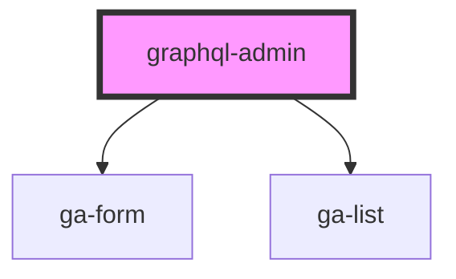

# graphql-admin

<!-- Auto Generated Below -->

## Properties

| Property     | Attribute     | Description | Type     | Default     |
| ------------ | ------------- | ----------- | -------- | ----------- |
| `dataPath`   | `data-path`   |             | `string` | `undefined` |
| `dataSource` | `data-source` |             | `string` | `undefined` |

## Dependencies

### Depends on

- [ga-form](../ga-form)
- [ga-list](../ga-list)

### Graph

----------------------------------------------

*Built with [StencilJS](https://stenciljs.com/)*
